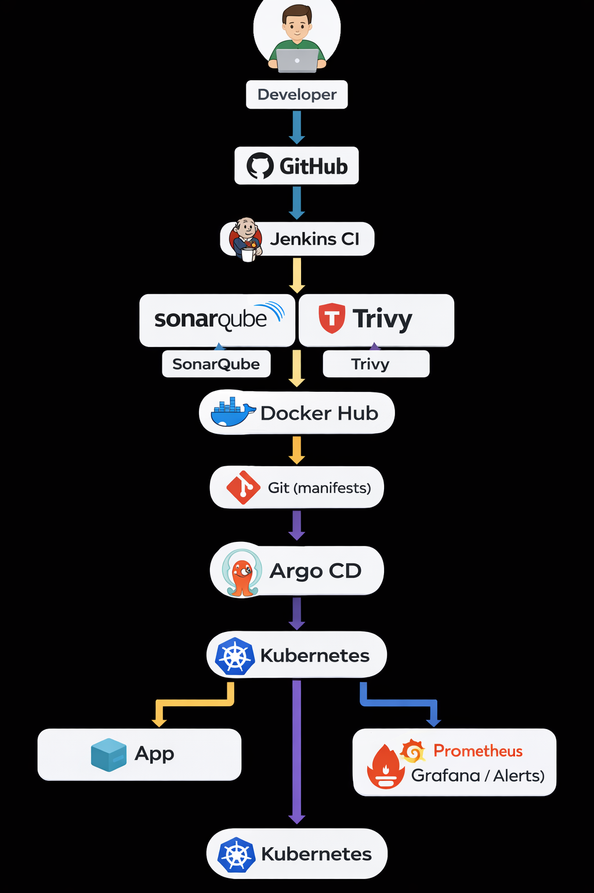

# 🚀 TaskFlow – End-to-End DevSecOps & GitOps Platform

A **production-grade DevSecOps and GitOps project** demonstrating how modern cloud-native applications are **built, secured, deployed, monitored, and operated** on Kubernetes using industry-standard tools.

This project reflects **real-world DevOps practices**, not a demo or tutorial.

---

## 🧭 Architecture Diagram

---

## 🎯 Project Purpose

Modern engineering teams face challenges such as:
- Poor code quality reaching production
- Vulnerable container images
- Manual and error-prone deployments
- No visibility into system health
- No alerting when failures occur

👉 **This project solves all of these problems using automation, security, and GitOps.**

---

## 🧠 What This Project Demonstrates

- Secure **CI pipelines (DevSecOps)**
- Automated **GitOps-based deployments**
- Kubernetes production patterns
- Full **observability and alerting**
- Real troubleshooting and system design skills

---

## 🧱 Technology Stack

### CI / DevSecOps
- **Jenkins** – CI pipeline
- **SonarQube** – Code quality & static analysis
- **Trivy** – Container image vulnerability scanning

### Containers & Orchestration
- **Docker**
- **Kubernetes**
- **NGINX Ingress Controller**

### GitOps Continuous Delivery
- **Argo CD**

### Observability & Reliability
- **Prometheus** – Metrics collection
- **Grafana** – Dashboards & visualization
- **Alertmanager** – Alerts and notifications

---

## 🔄 CI Pipeline Flow (DevSecOps)

1. Developer pushes code to GitHub
2. Jenkins pipeline triggers automatically
3. SonarQube scans backend code for quality issues
4. Docker images are built
5. Trivy scans images for vulnerabilities
6. Only secure images are pushed to Docker Hub

✔ Prevents bad code and vulnerable images from reaching production

---

## 🚀 Continuous Delivery (GitOps with Argo CD)

- Kubernetes manifests are stored in Git
- Argo CD continuously watches the repository
- Any change in Git is **automatically synced** to the cluster
- Self-healing and drift correction are enabled
- No manual `kubectl apply`

✔ Git is the **single source of truth**

---

## 📊 Observability & Alerts

### Monitoring
- Cluster-level metrics (CPU, memory, nodes)
- Pod and application metrics
- Ingress traffic and performance

### Dashboards
- Kubernetes Cluster Dashboard
- Node Exporter Dashboard
- Pod & Workload Dashboards
- Ingress / NGINX Dashboard

### Alerts
- Pod CrashLoopBackOff
- High CPU / Memory usage
- Node failures
- Kubernetes component issues

✔ Ensures reliability and fast incident response

---

## 🧪 Application Overview

**TaskFlow** is a simple task management application:
- Backend API service
- Frontend web UI
- Deployed as containerized workloads on Kubernetes
- Exposed via Ingress

The focus is **platform engineering**, not application complexity.

---

## 🧩 Key DevOps Concepts Proven

- DevSecOps (Shift-left security)
- GitOps continuous delivery
- Infrastructure automation
- Kubernetes self-healing
- Monitoring & alerting
- Production readiness

---

## 💼 Real-World Use Cases

This architecture is suitable for:
- SaaS platforms
- Fintech & payment systems
- Enterprise microservices
- Cloud-native startups
- Internal developer platforms

---

## 👨‍💻 Author

**Saifudheen PV**  
DevOps / Cloud Engineer  

- GitHub: https://github.com/Saifudheenpv  
- LinkedIn: https://linkedin.com/in/saifudheenpv07  

---

## 📌 Final Note

This project represents **real-world DevOps experience** and demonstrates how modern engineering teams deliver **secure, reliable, and observable systems** at scale.
